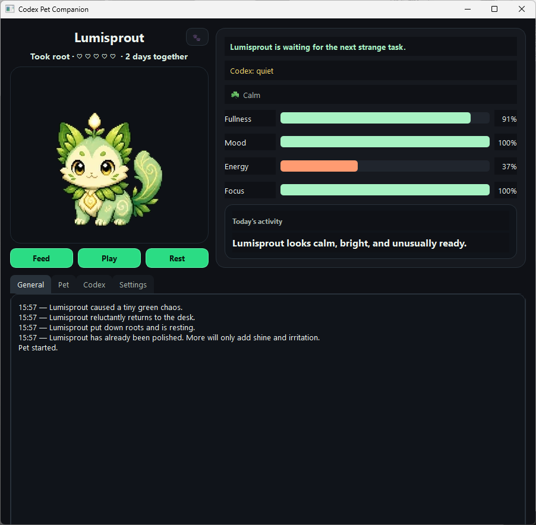

# Codex Pet Companion

A tiny tamagotchi-style desktop pet for Codex — made to sit beside your workflow, react to what Codex is doing, and slowly turn into a small companion with its own routine.

It notices tasks, tool calls, reviews, errors, quiet stretches, and care actions. It can live in a full desktop window or shrink into a compact mini pet when you want your workspace back.

## Screenshots

**Full mode**


**Mini mode**



## Download

Get the latest Windows build from the [Releases](https://github.com/pixel-raccoon/codex-pet-companion/releases) page.

Download the release zip, extract the `Codex Pet Companion` folder, and run:

```text
CodexPetCompanion.exe
```

The app includes an updater, so future versions can be installed from inside the app.

## Features

- Full desktop window and compact mini mode.
- Mini mode with short workflow notifications, similar to the official Codex pets.
- Reactions to Codex tasks, tool calls, reviews, errors, and quiet periods.
- Tamagotchi-style care: feed, play, rest, and click the pet in full mode.
- Fullness, mood, energy, focus, friendship, and days-together progression.
- Daily activities, idle discoveries, micro reactions, and high-bond moments.
- Two built-in pets:
  - Lumisprout — a tiny glowing sprout-cat forest spirit.
  - Vikamon — a mischievous chibi mascot in a green monster hoodie.
- Custom pet packs, so you can import pets made by other people or share your own.
- Built-in updater through GitHub Releases.

## How Codex affects the pet

Codex activity gives the pet something to react to.

When Codex starts working, runs tools, reaches review, finishes a response, goes quiet, or hits an error, the pet changes state, comments on the moment, and may gain or lose mood, focus, energy, or friendship.

The idea is simple: your coding workflow becomes part of the pet's day.

## How to use

1. Download the latest release zip.
2. Extract the `Codex Pet Companion` folder.
3. Run `CodexPetCompanion.exe`.
4. Open Settings and check that the Codex folder path is correct.
5. Choose a pet.
6. Use mini mode when you want the pet to stay out of the way.
7. Double-click the mini pet to return to the full window.

If you are running from source, use:

```text
start_companion_qt.bat
```

## Custom pets

Custom pets can be imported and exported from Settings.

A pet pack contains:

```text
pet.json
spritesheet.webp
```

Spritesheet format:

```text
1536x1872
8 columns x 9 rows
192x208 per frame
transparent background
```

Custom pets use neutral fallback text, so they do not receive Lumisprout or Vikamon-specific lines.

## Data and updates

Windows releases are distributed as a folder:

```text
Codex Pet Companion/
  CodexPetCompanion.exe
  updater.exe
  data/
```

Your config, state, progress, and custom pets are stored in:

```text
Codex Pet Companion/data/
```

The updater replaces application files but skips `data/`, so your pet progress and custom pets survive updates.

## Build from source

On Windows, install dependencies and run:

```text
build_windows_exe.bat
```

The build script creates:

```text
dist/Codex Pet Companion/
dist/Codex-Pet-Companion-windows-x64.zip
```

For a console/debug build, run:

```text
build_windows_exe_debug.bat
```

The release includes `app_icon.ico`, and the build scripts use it automatically.
