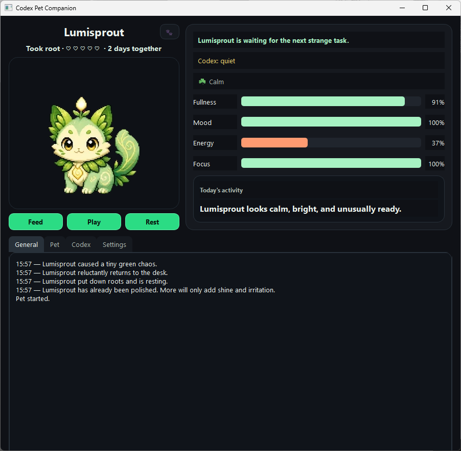

# Codex Pet Companion

A tiny tamagotchi-style desktop companion for Codex.



## Download

Get the latest Windows build from the [Releases](https://github.com/pixel-raccoon/codex-pet-companion/releases) page.

Download `CodexPetCompanion.exe`, run it, then choose your Codex folder in Settings.

## What it is

Codex Pet Companion is a small desktop pet that reacts to your Codex workflow.

It watches Codex activity and responds when tasks start, tools run, reviews are ready, errors happen, or the session goes quiet. The pet is not just a static mascot: it has mood, energy, focus, friendship, and days together.

## Features

- Full desktop window and compact mini mode.
- Mini mode with short activity notifications, similar to the official Codex pets.
- Pet reactions to Codex tasks, tool calls, ready reviews, errors, and idle periods.
- Tamagotchi-style care: feed, pet, play, rest, and talk to your companion.
- Mood, energy, focus, fullness, friendship, and days-together progression.
- Two built-in pets:
  - Lumisprout — a tiny glowing sprout-cat forest spirit.
  - Vikamon — a mischievous chibi mascot in a green monster hoodie.
- Custom pet packs, so you can add your own pets.
- Portable mode via `portable.flag`.

## How Codex affects the pet

Codex affects the pet through work activity.

When Codex starts a task, thinks, writes, or runs tools, the pet becomes more focused and gains a little friendship, but spends energy faster.

When Codex finishes an answer or review, the pet gains mood, focus, and friendship.

If Codex reports an error, the pet reacts as if stressed and may lose a little mood or focus.

In short: the pet lives next to your Codex workflow and reacts to activity, success, and errors.

## How to use

1. Download `CodexPetCompanion.exe` from Releases.
2. Run the app.
3. Open Settings.
4. Check that the Codex folder path is correct.
5. Choose a pet.
6. Open mini mode from the main window.
7. Double-click the mini pet to return to the full window.

If you are running from source, use:

```text
start_companion_qt.bat
```

## Custom pets

A pet pack must contain:

```text
pet.json
spritesheet.webp
```

Spritesheet grid:

```text
1536x1872
8 columns x 9 rows
192x208 per frame
transparent background
```

Custom pets use neutral fallback text, so they do not receive Lumisprout or Vikamon-specific lines.

## Where data is stored

Normal mode:

```text
%CODEX_HOME%/pet-companion/
```

If `CODEX_HOME` is not set:

```text
%USERPROFILE%/.codex/pet-companion/
```

This folder contains:

```text
config.json
state.json
```

Portable mode:

Create this empty file next to the app:

```text
portable.flag
```

When `portable.flag` exists, the app stores `config.json` and `state.json` next to itself.

## Build from source

On Windows, install dependencies and run:

```text
build_windows_exe.bat
```

The finished file will appear here:

```text
dist/CodexPetCompanion.exe
```

For a console/debug build, run:

```text
build_windows_exe_debug.bat
```

The release includes `app_icon.ico`, and the build scripts use it automatically.
